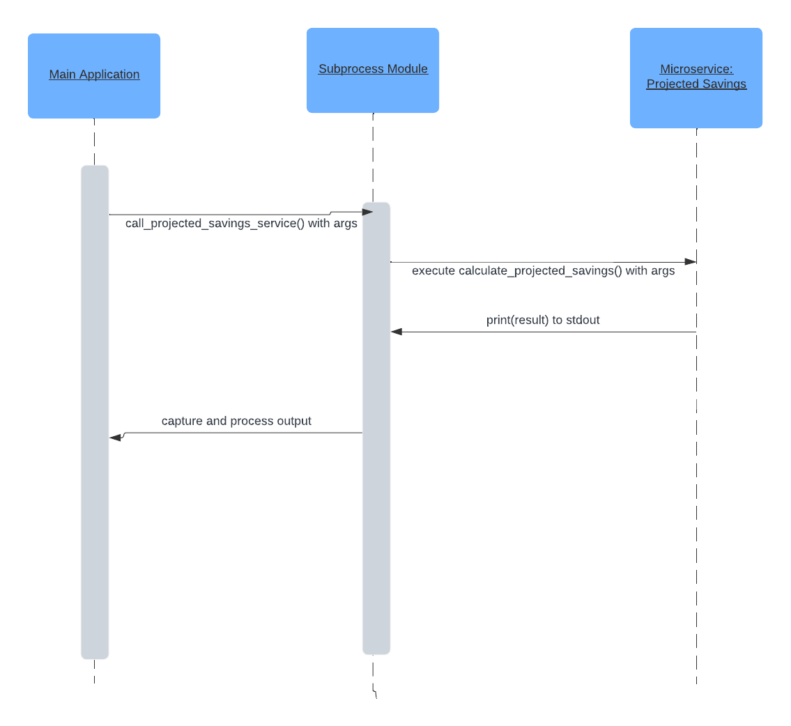

# Projected Savings Microservice

## Introduction
This microservice calculates the projected savings based on total savings, average monthly savings, and a specified number of months. It is designed to be called programmatically from a main application using Python's `subprocess` module.

## Requesting Data from the Microservice
To request data from this microservice, use the `subprocess` module in Python. The subprocess function is required to establish the appropriate API to the microservice and format and interpret the input/output. The microservice requires three arguments: total savings, average savings, and months in integer/float syntax. An example call below will show how to correctly use the microservice and example valid inputs.

## Receiving Data from the Microservice
The microservice outputs the result as a string. The calling program should capture this output using subprocess.run and then process it as needed, typically by converting it to the appropriate data type (e.g., float).

## Sequence Diagram
Please refer to the attached UML sequence diagram for a detailed understanding of how the main application requests and receives data from the microservice.


### Example Call (in Python):
```python
import subprocess

def call_projected_savings_service(total_savings, average_savings, months):
    process = subprocess.run(
        ["python", "projected_savings_service.py", str(total_savings), str(average_savings), str(months)],
        capture_output=True, 
        text=True
    )
    return process.stdout.strip()

# Example usage
projected_savings = call_projected_savings_service(1000, 200, 6)
print(f"Projected Savings: {projected_savings}")

